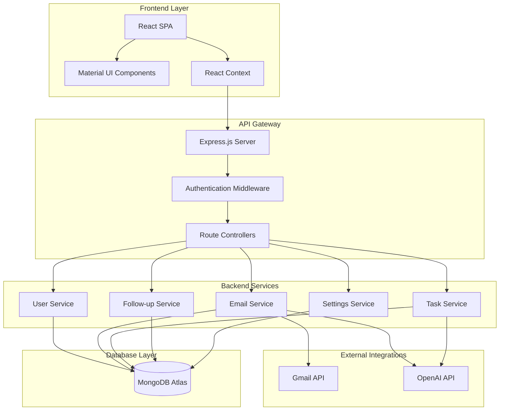
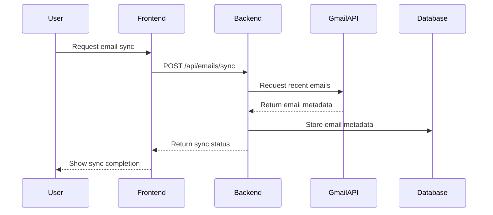
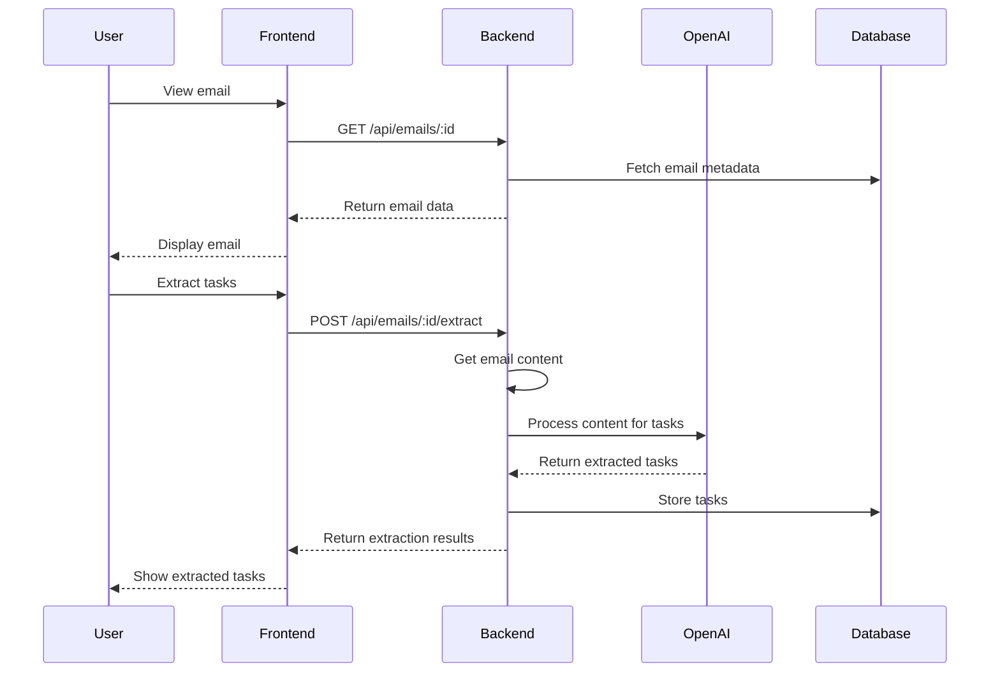
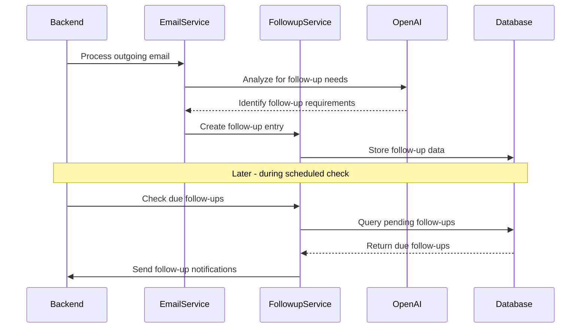
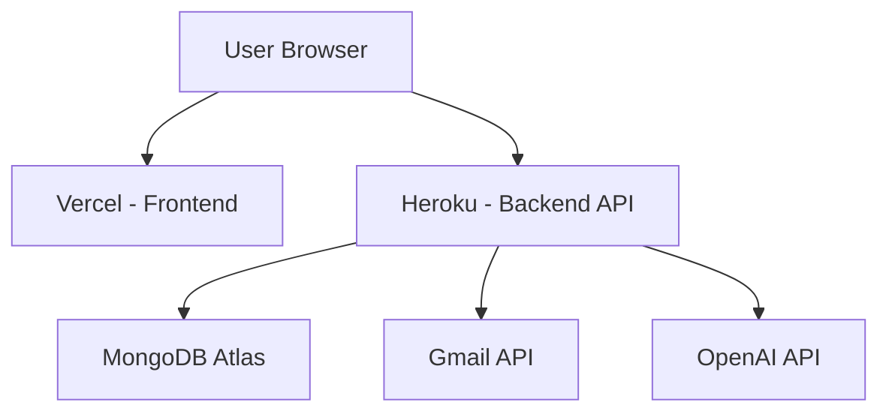

# TaskMaster AI - MVP Technical Architecture

## System Architecture Overview

The TaskMaster AI MVP will use a modern, scalable architecture with clear separation of concerns. The system is designed to be developed and maintained by a single developer while providing a solid foundation for future expansion.



## Component Details

### Frontend Layer

#### React Single Page Application
- **Framework**: Create React App
- **State Management**: React Context API for global state
- **Routing**: React Router v6
- **HTTP Client**: Axios for API requests
- **Forms**: Formik with Yup validation
- **Styling**: Material-UI for component library
- **Dates**: date-fns for date manipulation

#### Key Frontend Components
- **AppLayout**: Main layout with navigation
- **Dashboard**: Home view with tasks overview
- **TaskList**: Display and manage tasks
- **EmailView**: Display emails with task extraction
- **FollowupManager**: Manage follow-ups
- **Settings**: User preferences and configuration

### API Layer

#### Express.js Server
- **Framework**: Express.js
- **Authentication**: Passport.js with Google OAuth strategy
- **Middleware**: JWT token validation, error handling, logging
- **API Docs**: Swagger for API documentation
- **Validation**: Joi for input validation
- **Logging**: Winston for server logs

#### API Endpoints Structure
```
/api
  /auth
    /google
    /logout
    /refresh
  /tasks
    /
    /:id
    /priority
    /status
  /emails
    /
    /:id
    /sync
    /extract
  /followups
    /
    /:id
    /remind
  /settings
    /
    /preferences
```

### Backend Services

#### User Service
- **Functionality**: User authentication and profile management
- **Key Methods**:
  - `authenticateWithGoogle(code)`
  - `getUserProfile(userId)`
  - `updateUserProfile(userId, data)`
  - `refreshTokens(refreshToken)`

#### Email Service
- **Functionality**: Email synchronization and processing
- **Key Methods**:
  - `syncUserEmails(userId)`
  - `getEmailMetadata(userId, filters)`
  - `getEmailContent(userId, emailId)`
  - `processEmailForTasks(userId, emailId)`

#### Task Service
- **Functionality**: Task management and organization
- **Key Methods**:
  - `getTasks(userId, filters)`
  - `createTask(userId, taskData)`
  - `updateTask(userId, taskId, taskData)`
  - `deleteTask(userId, taskId)`
  - `extractTasksFromText(text)`

#### Follow-up Service
- **Functionality**: Track and manage follow-up reminders
- **Key Methods**:
  - `getFollowUps(userId, filters)`
  - `createFollowUp(userId, followUpData)`
  - `updateFollowUpStatus(userId, followUpId, status)`
  - `checkDueFollowUps(userId)`

#### Settings Service
- **Functionality**: User preferences and system configuration
- **Key Methods**:
  - `getUserSettings(userId)`
  - `updateUserSettings(userId, settingsData)`
  - `getIntegrationStatus(userId, integrationType)`
  - `toggleIntegration(userId, integrationType, status)`

### External Integrations

#### Gmail API Integration
- **Authentication**: OAuth 2.0 with refresh tokens
- **Scopes**: 
  - `https://www.googleapis.com/auth/gmail.readonly` 
  - `https://www.googleapis.com/auth/gmail.labels`
- **Main Operations**:
  - Fetch email metadata and content
  - Monitor for new emails
  - Read email threads

#### OpenAI API Integration
- **Models**: GPT-4 for task extraction
- **Main Operations**:
  - Task extraction from email content
  - Entity recognition
  - Intent classification
  - Priority suggestion

### Database Layer

#### MongoDB Schema Design
- **Collections**:
  - `users`: User profiles and authentication
  - `tasks`: Task data and metadata
  - `emails`: Email metadata (not content)
  - `followups`: Follow-up tracking
  - `settings`: User preferences

#### Indexing Strategy
- Index on `userId` for all collections
- Compound indexes for common query patterns
- Text indexes for search functionality

## Data Flow Examples

### Email Synchronization Flow



### Task Extraction Flow



### Follow-up Detection Flow



## Development Environment Setup

### Local Development
- **Node.js**: v16.x or higher
- **NPM**: v8.x or higher
- **MongoDB**: Local instance or MongoDB Atlas
- **IDE**: VSCode with recommended extensions
- **Environment Variables**: Managed via dotenv

### Environment Variables
```
# Server
PORT=8000
NODE_ENV=development

# MongoDB
MONGODB_URI=mongodb://localhost:27017/taskmaster
MONGODB_URI_PROD=mongodb+srv://...

# Authentication
JWT_SECRET=your_jwt_secret
JWT_EXPIRY=1d
REFRESH_TOKEN_SECRET=your_refresh_token_secret
REFRESH_TOKEN_EXPIRY=7d

# Google OAuth
GOOGLE_CLIENT_ID=your_google_client_id
GOOGLE_CLIENT_SECRET=your_google_client_secret
GOOGLE_CALLBACK_URL=http://localhost:8000/api/auth/google/callback

# OpenAI API
OPENAI_API_KEY=your_openai_api_key
```

### Development Workflow
1. Run frontend and backend in development mode
2. Implement features in vertical slices (UI + API + service)
3. Test manually as you develop
4. Commit regularly with descriptive messages
5. Deploy when significant features are complete

## Deployment Architecture

### MVP Deployment
- **Frontend**: Vercel (free tier)
- **Backend**: Heroku (free tier)
- **Database**: MongoDB Atlas (free tier)
- **Domain**: Custom domain with Cloudflare DNS



### Scaling Considerations for Post-MVP
- **Containerization**: Docker for consistent environments
- **Scheduled Jobs**: Implement job queue with Bull.js
- **Caching**: Add Redis for performance improvement
- **Monitoring**: Basic NewRelic free tier

## Security Considerations

### Authentication & Authorization
- JWT-based authentication with short expiry
- Refresh token rotation for persistent sessions
- OAuth 2.0 for third-party integrations
- Role-based access control for future multi-user support

### Data Protection
- HTTPS for all communications
- Environment variable protection with .env
- Input validation on all API endpoints
- MongoDB connection with IP whitelist

### API Security
- Rate limiting for public endpoints
- CORS configuration
- Helmet.js for HTTP security headers
- JSON Web Token verification middleware

## Performance Considerations

### Frontend Optimization
- Code splitting for faster initial load
- Lazy loading for non-critical components
- Memoization for expensive calculations
- Virtualized lists for large datasets

### Backend Optimization
- Database query optimization
- Efficient indexing strategy
- Pagination for large result sets
- Cache frequently accessed data

## Monitoring and Logging

### Error Tracking
- Sentry.io integration (free tier)
- Custom error handling middleware
- Structured error responses

### Application Logging
- Winston for structured logging
- Log rotation for development environment
- Different log levels for production and development

## Future Technical Considerations

### Scalability Path
1. Implement serverless functions for background processing
2. Add Redis caching for frequently accessed data
3. Implement GraphQL for more efficient data fetching
4. Split monolithic backend into microservices as needed

### Advanced Feature Implementation
1. Machine learning pipeline for improved task extraction
2. Real-time notifications using WebSockets
3. Advanced analytics with data aggregation
4. Mobile app with React Native

## Technical Debt Management

### Monitoring Technical Debt
- Regular code reviews (self-review)
- Maintain a technical debt log
- Schedule regular refactoring sessions

### Refactoring Priorities
1. Keep core services modular and testable
2. Regularly update dependencies
3. Maintain consistency in code style and patterns
4. Document complex algorithms and business logic

## Conclusion

This technical architecture provides a solid foundation for the TaskMaster AI MVP, balancing development speed with maintainability. The design emphasizes clear separation of concerns, standardized API patterns, and efficient data flow to enable one developer to build and maintain the system effectively.

The architecture is deliberately kept simple for the MVP phase while providing clear paths for future expansion. By focusing on core functionality and leveraging cloud services for infrastructure, development effort can be concentrated on delivering value to users.
