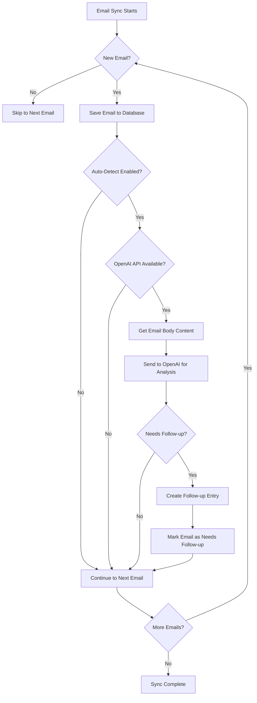
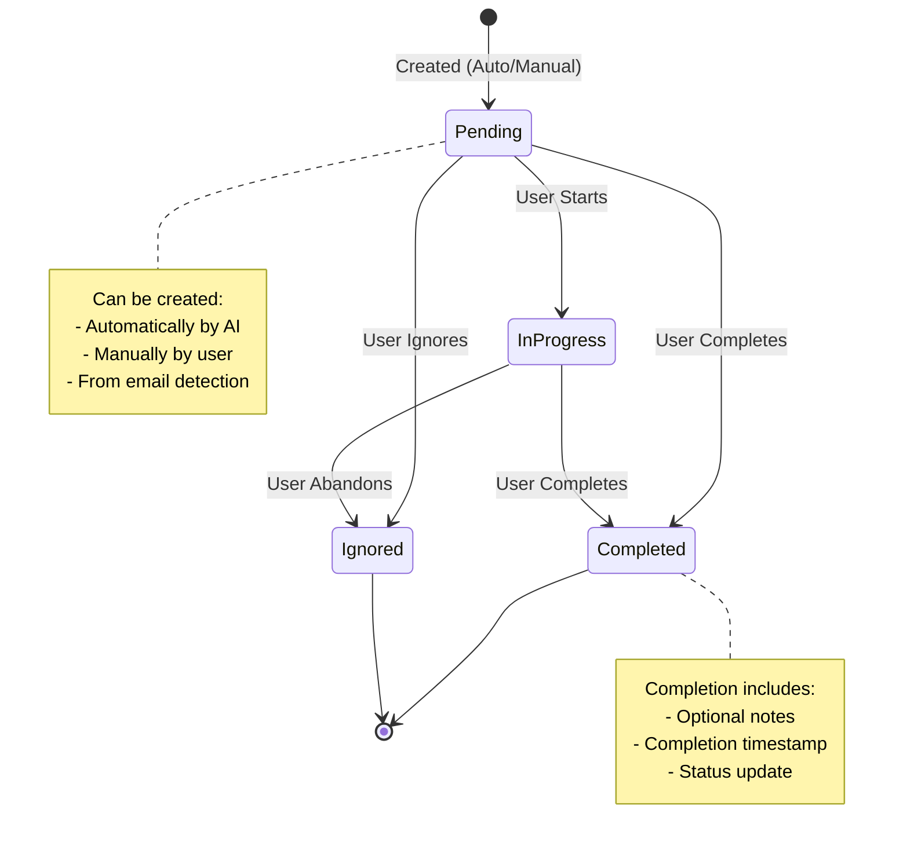
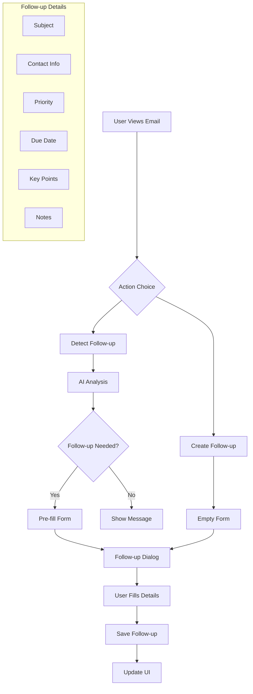
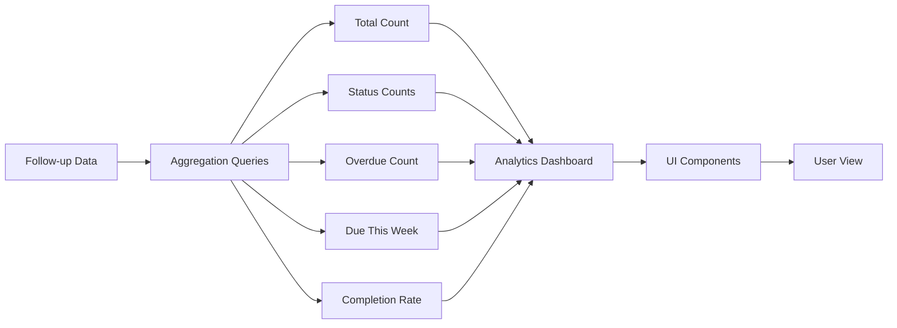
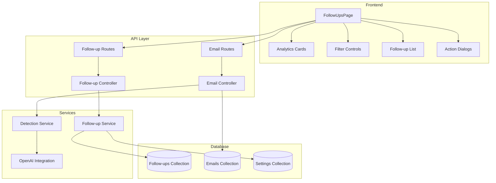
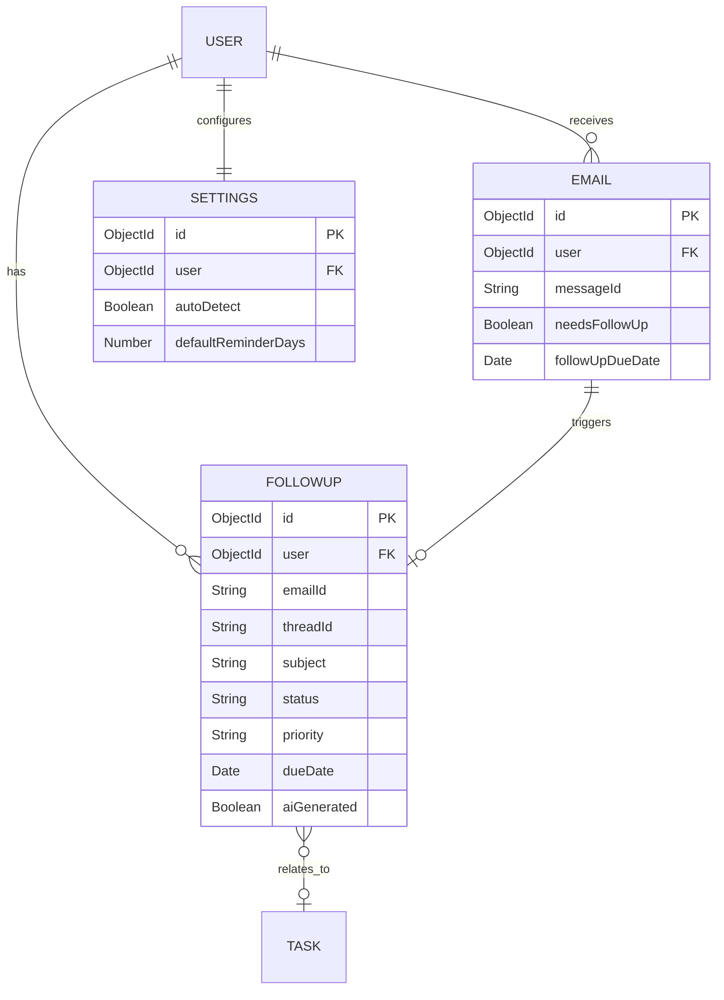
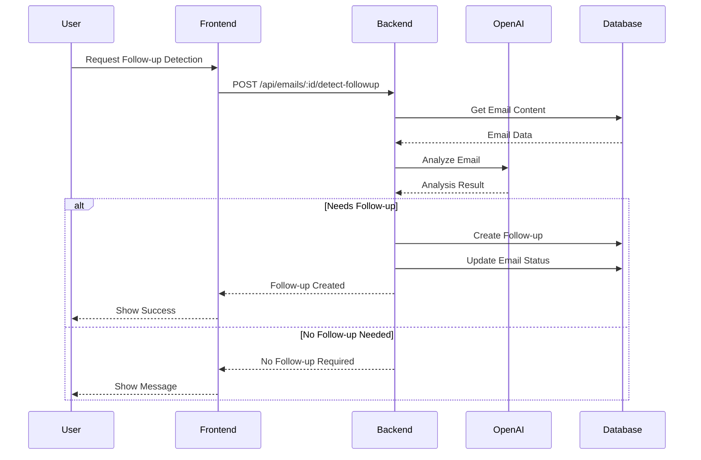
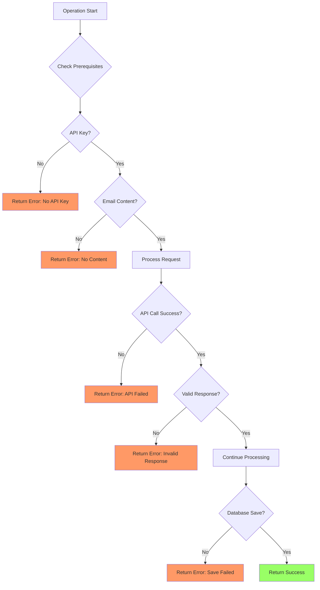
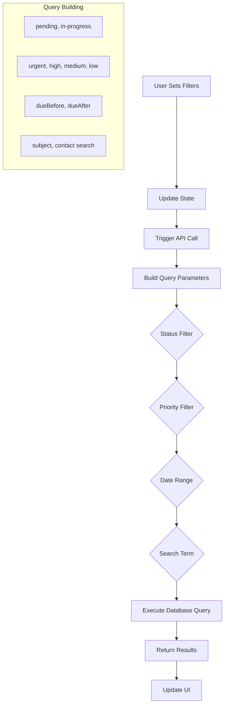

# Follow-up System Flow Diagram

## Email Processing and Follow-up Detection Flow

## Follow-up Lifecycle

## User Interaction Flow

## Analytics Data Flow

## System Architecture

## Data Model Relationships

## API Request Flow

## Error Handling Flow

## Filter and Search Flow

These diagrams illustrate the various flows and interactions within the follow-up system, making it easier to understand how different components work together.
