# Tasks vs Follow-ups: Visual Guide

## System Overview


## Key Differences Visualization


## Creation Flow Comparison

```mermaid
flowchart TD
    subgraph Task Creation
        A1[Email Content] --> B1[Extract Action Items]
        B1 --> C1[Identify Deadlines]
        C1 --> D1[Create Individual Tasks]
        D1 --> E1[✓ Review document<br>✓ Schedule meeting<br>✓ Send report]
    end
    
    subgraph Follow-up Creation
        A2[Email Context] --> B2[Analyze Conversation]
        B2 --> C2[Detect Response Need]
        C2 --> D2[Create Single Follow-up]
        D2 --> E2[📧 Reply to client inquiry<br>with key points]
    end
```



## Status Workflow Comparison


## Data Model Comparison


## Use Case Decision Tree


## Interface Comparison


## Feature Comparison Matrix

```mermaid
graph TD
    subgraph Features
        A[Features] --> B[Tasks]
        A --> C[Follow-ups]
        
        B --> B1[✓ Subtasks]
        B --> B2[✓ Categories]
        B --> B3[✓ Time Estimates]
        B --> B4[✓ Dependencies]
        B --> B5[✗ Contact Info]
        B --> B6[✗ Email Thread]
        
        C --> C1[✗ Subtasks]
        C --> C2[✗ Categories]
        C --> C3[✗ Time Estimates]
        C --> C4[✗ Dependencies]
        C --> C5[✓ Contact Info]
        C --> C6[✓ Email Thread]
    end
    
    style B fill:#e3f2fd
    style C fill:#fff8e1
```



## AI Processing Difference


## Priority Systems


## Integration Points


## Example Email Processing

```mermaid
flowchart TD
    subgraph Email Content
        E[Email from Client:<br>"Please review the proposal<br>and schedule a meeting.<br>Can you confirm by Friday?"]
    end
    
    E --> AI[AI Analysis]
    
    AI --> T[Tasks Created]
    AI --> F[Follow-up Created]
    
    subgraph Tasks
        T --> T1["📋 Review proposal"]
        T --> T2["📅 Schedule meeting"]
    end
    
    subgraph Follow-up
        F --> F1["📧 Confirm to client by Friday<br>Key points:<br>- Proposal feedback<br>- Meeting schedule"]
    end
    
    style Tasks fill:#e3f2fd
    style Follow-up fill:#fff8e1
```

## Analytics Comparison


## Decision Framework


These visual diagrams help illustrate the key differences between tasks and follow-ups in the TaskMaster system, making it easier for users and developers to understand when and how to use each feature.
